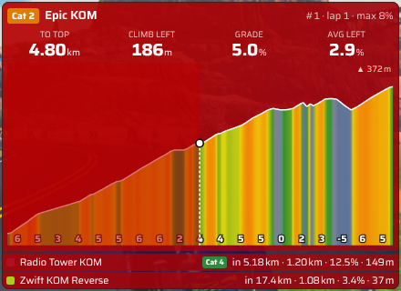
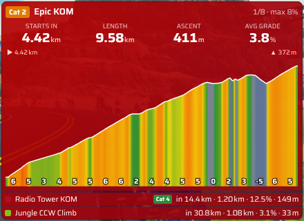
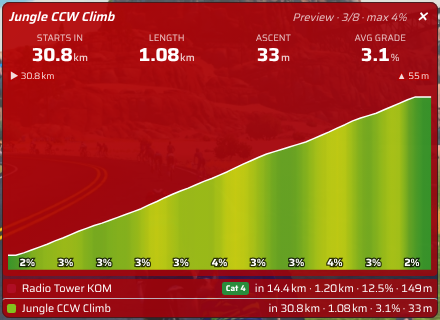

# Hill Radar for Sauce for Zwift

A [Sauce for Zwift](https://www.sauce.llc/products/sauce4zwift/) mod that finds the climbs on the route you are riding and shows the current or next climb, the same idea as a bike computer's climb feature:

- A profile of the climb colored by gradient, with your position on it
- **To top**: distance left to the top of the climb
- **Climb left**: elevation still to climb, including any dips you will have to climb back out of
- Current grade and the average grade of what is left
- Before a climb: distance to the start, length, ascent and average grade
- A list of the next climbs on the route
- At the top of a climb, a short **climb summary**: time, average power, W/kg, VAM, average and max heart rate, average speed and cadence (marked "partial" if you joined partway up)
- Climb numbers count every climb since the start of the ride, across laps (e.g. **4/6 · lap 2** in an event, **#5 · lap 3** on a free ride)
- A **Route climbs** list (title bar button) of every climb on the route; click any climb there or in the upcoming list to preview it

## Screenshots

| Halfway up the Epic KOM | Next climb at the start of The Uber Pretzel | Preview of a later climb |
| --- | --- | --- |
|  |  |  |

Shown with Sauce's default theme. Climbing the Epic KOM: distance to the top, climbing left (including the dip near the summit), current grade and the average of what is left, with the part already climbed dimmed. At the start of a route: the next climb and the ones after it. Clicking a climb in the list previews it; the ✕ goes back to live.

## Climb detection

A climb has to be at least 500 m long with an average grade of at least 3%. Each climb gets a score of length (m) x average grade (%), which sets its category:

| Category | Score |
| --- | --- |
| HC | 80,000+ |
| Cat 1 | 64,000+ |
| Cat 2 | 32,000+ |
| Cat 3 | 16,000+ |
| Cat 4 | 8,000+ |
| Uncategorized | below 8,000 |

The **Climb detection** setting picks the smallest climbs shown:

- **All climbs**: score 1,500 or more
- **Medium and large climbs**: score 3,500 or more
- **Only large climbs**: score 8,000 or more

**Include gentle climbs** (off by default) lowers the minimum average grade for detected climbs from 3% to 1.5%, so long gentle drags show too (e.g. the 1.9% rise out of the desert before Titans Grove on Sand and Sequoias). It adds about 250 small climbs across all routes, so it is best combined with Medium or Only large if you want fewer.

Climbs continue through dips and short descents, so a climb with a dip in the middle shows as one climb. Flat or gentle run-ups are trimmed off the ends.

Detection works on routes and events (including multi-lap and distance-based events). When riding without a route, it uses the current road only.

**Climb Portal:** the portal climb is shown as one climb with its name (e.g. Ski Lift Climb, Cauberg). The gradients and elevation follow your Climb Portal difficulty setting, the same way Zwift scales them, so at 50% difficulty a 8% climb shows as 4%. Like Zwift, the climb ends at the finish gate, so the flat run-out past it isn't counted. Climb names and finish gates come from Sauce (2.3 or newer).

When the route has an official Zwift climb segment (a KOM), that climb uses the segment's name and covers at least the segment's official start and end (detected climbing just before or after it is kept). The segment still has to average at least 3% (2% for segments Zwift names as a KOM, such as Titans Grove KOM at 2.2%) and meet the detection size, so sprints, laps, whole-course segments and very gentle segments are not shown as climbs. Official segments don't need the 500 m minimum length, so short KOMs such as Innsbruck's Leg Snapper (422 m at 6.9%) are included. Climbs without an official segment are found from the elevation profile. When one of those matches a well-known unofficial climb (for example San Luca on the Bologna Time Trial, or the climbs named in Brian Mudge's S4Z mods), it gets that name; otherwise it is shown as "Climb 1", "Climb 2" and so on.

## Settings

- Climb detection: All / Medium and large / Only large
- Include gentle climbs (1.5%+ instead of 3%)
- Show next climb within (km or mi; 0 = always)
- Climb summary at the top, and how long it shows (5–30 seconds)
- Hide when no climb
- Upcoming climbs list (0 to 5)
- Units: Auto (follows Sauce), Metric or Imperial
- Gradient color scheme: Classic, Sauce, Veloviewer (ish), CVD-BuRd, CVD-PRGn, CVD-Sunset
- Gradient coloring: Smooth (high resolution, colored point by point) or Sections
- Gradient color opacity, section length, grade labels, dim the completed part
- Font scaling, theme override, solid background, data background opacity
- Show position info: shows where Hill Radar thinks you are and the data it used (handy when reporting a problem)

The window can be resized; everything scales with it.

## Install

**From the Sauce mod store** (recommended): Hill Radar is listed in the [Sauce mod store](https://mods.sauce.llc). Open Sauce's mod settings, find **Hill Radar** and install it; updates arrive the same way.

**Manually:**

1. Download the latest release from the [Releases page](https://github.com/Aryeh95/s4z-hill-radar/releases) (or a tag's **Source code (zip)** under [Tags](https://github.com/Aryeh95/s4z-hill-radar/tags)) and unzip it.
2. Put the folder in your Sauce mods folder (usually `Documents\SauceMods`). If you had an earlier copy, replace it.
3. Restart Sauce, enable **Hill Radar** in Sauce's mod settings, and add the **Hill Radar** window.

## Development

To release: bump `version` in `manifest.json` and `package.json`, add a `## <version>` section to `CHANGELOG.md`, and push to `main`. The Release workflow then tags `v<version>`, builds the zip and publishes a GitHub release with it.

`npm run zip` builds the release zip (`dist/hill-radar-<version>.zip`, a single `hill-radar/` folder with only the files Sauce needs), as used for the Sauce mod store.

The climb detection, colors and unit formatting are plain JavaScript modules in `pages/src/` with tests:

```
npm test
```

## Credits

Gradient color schemes follow those in [Zenmaster's S4Z mods](https://github.com/Zenmaster28/Zenmaster-s4z-mods).
Names for unofficial climbs come mostly from Brian Mudge's S4Z mods (GPL-3.0); Climb Portal climb names come from Sauce, with Zenmaster's S4Z mods' list as a fallback for older Sauce versions.
Climb scoring follows the common climb score used by bike computers.

## License

[GPL-3.0](LICENSE)
